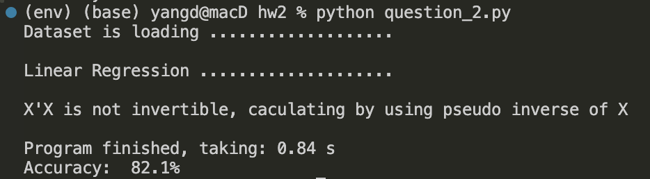
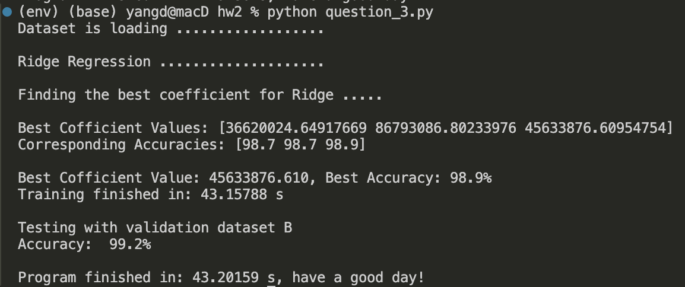
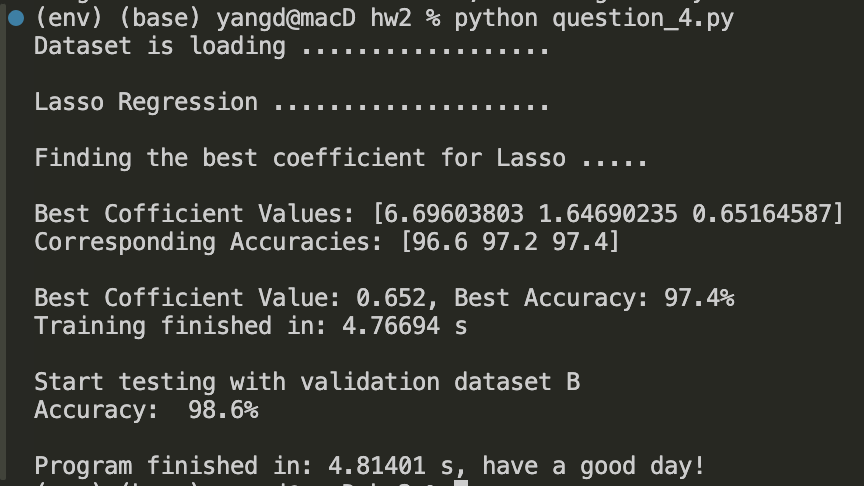
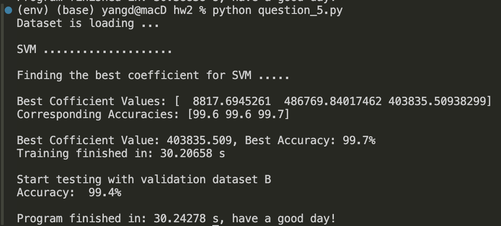

# 人工智能基础算法 - 作业二
阮黄阳 _ 2023080149 _ 数学科学系
## O. 准备
### 1. 数据读取
    CURRENT_DIRECTORY      =  os.getcwd()

    TRAIN_DATA_IMG_PATH    =  os.path.join(CURRENT_DIRECTORY，
                              'Homework2/morpho_mnist/train/train_mnist.npy')
    TRAIN_DATA_LBL_PATH    =  os.path.join(CURRENT_DIRECTORY, 
                              'Homework2/morpho_mnist/train/train_label.npy')
    TEST_DATA_IMG_PATH     =  os.path.join(CURRENT_DIRECTORY, 
                              'Homework2/morpho_mnist/test/test_mnist.npy')
    TEST_DATA_LBL_PATH     =  os.path.join(CURRENT_DIRECTORY, 
                              'Homework2/morpho_mnist/test/test_label.npy')

    TRAIN_DATA_IMG         =  np.load(TRAIN_DATA_IMG_PATH)
    TRAIN_DATA_LBL         =  np.load(TRAIN_DATA_LBL_PATH)
    TEST_DATA_IMG          =  np.load(TEST_DATA_IMG_PATH)
    TEST_DATA_LBL          =  np.load(TEST_DATA_LBL_PATH)

### 2. 分类函数
    def classificate(x):
        x = np.array(x)  
        return np.where(abs(x) < abs(x - 1), 0, 1)

### 3. 计算准确率函数
    def accuracy(predictions, true_labels):
        return np.mean(predictions == true_labels)

### 4. 随机取参数
    lambda_values = np.random.uniform(low=1e-9, high=1e9, size=150)
    #from low to high takes 150 numbers

## A. 第一问题：
> 试推导 RidgeRegression 的解，可参考课件LN3的14页、26页，请将推 导过程附在报告中。

Ridge Regression 是一种用于解决多重共线性问题的线性回归方法。下面是Ridge Regression解的推导过程。

### 1.1 线性回归模型

假设我们有一个线性回归模型：

$$
y = X\beta + \epsilon
$$

其中：
- $y$ 是响应变量,
- $X$ 是输入特征矩阵,
- $\beta$ 是我们需要估计的回归系数,
- $\epsilon$ 是误差项。

### 1.2 最小化目标与其的解

Ridge Regression 的目标是最小化以下损失函数：

$$
L(\beta) = \|y - X\beta\|^2 + \lambda \|\beta\|^2
$$

这里，第一项是普通最小二乘法（OLS）的损失，第二项是正则化项，其中 $\lambda$ 是正则化参数。

我们可以将损失函数展开：

$$
L(\beta) = (y - X\beta)^{T}(y - X\beta) + \lambda \beta^{T}\beta
$$

展开后得到：

$$
L(\beta) = y^{T}y - 2y^{T}X\beta + \beta^{T}X^{T}X\beta + \lambda \beta^{T}\beta
$$

为了找到最优的 $\beta$，我们对 $L(\beta)$ 关于 $\beta$ 求导，并让其等于零：

$$
\frac{\partial L}{\partial \beta} = -2X^{T}y + 2X^{T}X\beta + 2\lambda \beta = 0
$$

整理得到：

$$
X^{T}X\beta + \lambda \beta = X^{T}y
$$

可以将上面的方程重新整理为：

$$
(X^{T}X + \lambda I)\beta = X^{T}y
$$

其中 $I$ 是单位矩阵。

由于 $(X^{T}X + \lambda I)$ 一定是可逆的，我们可以解出 $\beta$：

$$
\beta = (X^{T}X + \lambda I)^{-1}X^{T}y
$$

## B. 第二问题：
> 利用线性回归，实现对手写数字的粗体和细体进行分类。测试并报告以 A 为训练集、B 为测试集的分类准确率。请根据原理自行编程，若直接使用现有集 成工具包，只得 40%的分数。

### 1. Linear Regression 核心代码
    class LinearRegression:

        def fit(self, X, y):
            # Flatten images
            X_flat = X.reshape(X.shape[0], -1)  
            y_flat = y.reshape(-1, 1) 

            # Convert data to tensors
            X_tensor = tf.convert_to_tensor(X_flat, dtype=tf.float32)
            y_tensor = tf.convert_to_tensor(y_flat, dtype=tf.float32)

            # Add a column of ones for the bias term
            X_b = tf.concat([tf.ones((X_tensor.shape[0], 1), dtype=tf.float32), X_tensor], axis=1)

            try:
                # Calculate weights using the least squares formula
                self.weights = tf.linalg.inv(tf.matmul(tf.transpose(X_b), X_b))
                               @ tf.matmul(tf.transpose(X_b), y_tensor)
                print('X is invertible')

            except tf.errors.InvalidArgumentError:
                # If X_b is not invertible, use pseudo-inverse
                X_b_pseudo = np.linalg.pinv(X_b.numpy())  # Use NumPy to compute pseudo-inverse
                self.weights = tf.convert_to_tensor(X_b_pseudo 
                               @ y_tensor.numpy(), dtype=tf.float32)  # Convert back to tensor
                print('X is not invertible')

        def predict(self, X):
            # Flatten images for prediction
            X_flat = X.reshape(X.shape[0], -1)  # Convert to shape [n_samples, n_features]

            # Convert input to tensor
            X_tensor = tf.convert_to_tensor(X_flat, dtype=tf.float32)

            # Add a column of ones for the bias term
            X_b = tf.concat([tf.ones((X_tensor.shape[0], 1), dtype=tf.float32), X_tensor], axis=1)

            # Make predictions
            predictions = tf.matmul(X_b, self.weights)
            return classificate(predictions.numpy().flatten()) 

### 2. 代码运行结果

## C. 第三问题：
> 利用Ridge回归，在训练集A中使用10折交叉检验法，测试并报告采用 不同正则化系数 $\lambda$ 的分类准确率，进而得到最佳超参数并在测试集 B 下测试分类准确率。请根据原理自行编程，若直接使用现有集成工具包，只得 40%的分 数。
### 1. Ridge Regression 核心代码
    class RidgeRegression:
        def __init__(self,k):
            self.k = k

        def fit(self, X, y):
            # Flatten images
            X_flat = X.reshape(X.shape[0], -1)  
            y_flat = y.reshape(-1, 1) 

            # Convert data to tensors
            X_tensor = tf.convert_to_tensor(X_flat, dtype=tf.float32)
            y_tensor = tf.convert_to_tensor(y_flat, dtype=tf.float32)

            # Add a column of ones for the bias term
            X_b = tf.concat([tf.ones((X_tensor.shape[0], 1), dtype=tf.float32), X_tensor], axis=1)

            # Calculate weights using the least squares formula
            self.weights = tf.linalg.inv(tf.matmul(tf.transpose(X_b), X_b) + 
                           self.k * tf.eye(X_tensor.shape[1]+1)) @ tf.matmul(tf.transpose(X_b), y_tensor)

        def predict(self, X):
            # Flatten images for prediction
            X_flat = X.reshape(X.shape[0], -1)  # Convert to shape [n_samples, n_features]

            # Convert input to tensor
            X_tensor = tf.convert_to_tensor(X_flat, dtype=tf.float32)

            # Add a column of ones for the bias term
            X_b = tf.concat([tf.ones((X_tensor.shape[0], 1), dtype=tf.float32), X_tensor], axis=1)

            # Make predictions
            predictions = tf.matmul(X_b, self.weights)
            return classificate(predictions.numpy().flatten()) 
### 2. Ridge Regression + 10 折交叉检验法
    x = TRAIN_DATA_IMG
    y = TRAIN_DATA_LBL

    kf = KFold(n_splits=10, shuffle = True)

    accuracies = [] # Mean accuracy of each lambda
    lambda_values = np.random.uniform(low=1e-9, high=1e9, size=150)

    for i in lambda_values:
        acrc_part = [] # Accuracies of batches using the same lambda
        for train_index, val_index in kf.split(x):
            x_train, x_val = x[train_index], x[val_index]
            y_train, y_val = y[train_index], y[val_index]

            # Create model and fit
            model = RidgeRegression(i)
            model.fit(x_train, y_train)

            predictions = model.predict(x_val) 

            acrc_part.append(accuracy(predictions,y_val))
        
        mean_acrc = np.mean(acrc_part)
        accuracies.append(mean_acrc)
### 3. 代码运行结果

### 4. 结果分析
- 正则化参数取较大的值 $(10^{4},10^7)$ 使得准确率达到最高值
  
  Best Cofficient Values: [36620024.64, 86793086.80, 45633876.60]
  
  Corresponding Accuracies: [98.7, 98.7, 98.9] 
- 通过调整参数得知当选择正则化参数较小 （小于1000）或者较大（大于10e8）准确率会降低。
## D. 第四问题：
> 调用 Lasso 回归，在训练集A中使用10折交叉检验法，测试并报告采用 不同正则化系数 $\gamma$的分类准确率，进而得到最佳超参数并在测试集 B 下测试分类准确率。

### 1. Lasso Regression + 10 折交叉检验法
    x = TRAIN_DATA_IMG.reshape(1000,784)
    y = TRAIN_DATA_LBL

    kf = KFold(n_splits=10, shuffle = True)

    accuracies = []
    gamma_values = np.random.uniform(low=1e-10, high=100, size=50)

    for i in gamma_values:
        acrc = []
        for train_index, val_index in kf.split(x):
            x_train, x_val = x[train_index], x[val_index]
            y_train, y_val = y[train_index], y[val_index]

            model = Lasso(alpha = i)
            model.fit(x_train,y_train)

            predictions = model.predict(x_val)
            acc_rate = accuracy(classificate(predictions),y_val)
            acrc.append(acc_rate)
        
        mean_acrc = np.mean(acrc)
        accuracies.append(mean_acrc)

### 2. 代码运行结果

### 3. 结果分析
- 正则化参数取较小的值 $(0,20]$ 使得准确率达到最高值
  
  Best Cofficient Values: [6.69, 1.64, 0.65]
  
  Corresponding Accuracies: [96.6, 97.2, 97.4] 

- 通过调整参数得知当选择正则化参数较大（大于50）准确率会降低到 $60\%$ 以下。

## E. 第五问题：
### 1. SVM + 10 折交叉检验法
    x = TRAIN_DATA_IMG.reshape(1000,784)
    y = TRAIN_DATA_LBL

    kf = KFold(n_splits=10, shuffle = True)

    accuracies = []
    C_values = np.random.uniform(low=10e-5, high=10e5, size=150)

    print("Finding the best coefficient for SVM ..... \n ")

    for i in C_values:
        acrc = []
        for train_index, val_index in kf.split(x):
            x_train, x_val = x[train_index], x[val_index]
            y_train, y_val = y[train_index], y[val_index]

            model = SVC(C = i, kernel = 'linear')
            model.fit(x_train,y_train)

            predictions = model.predict(x_val)
            acc_rate = accuracy(classificate(predictions),y_val)
            acrc.append(acc_rate)
        
        mean_acrc = np.mean(acrc)
        accuracies.append(mean_acrc)

### 2. 代码运行结果

### 3. 结果分析
- 正则化参数取较大的值 $(10^{3},10^6)$ 使得准确率达到最高值
  
  Best Cofficient Values: [8817.69,  486769.84, 403835.509]

  Corresponding Accuracies: [99.6, 99.6, 99.7] 

## 第六问题：
> 比较并讨论上述四种方法的结果。
- 根据结果有线性回归的准确率最低（90% 以下），SVM 的准确率最高（99% 以上），Ridge和Lasso回归的准确率差别不大在 98% 左右。因为线性回归是一个简单的模型，易于解释，但在特征多、相互关系复杂的数据集上，可能会欠拟合。Ridge 和 Lasso 通过引入正则化项来控制模型复杂度，帮助减少过拟合，尤其是在特征数量大于样本数量时。
- 不同的回归方法取不一样的的正则化参数，原因不在于算法，而是因为数据的特征。
  

